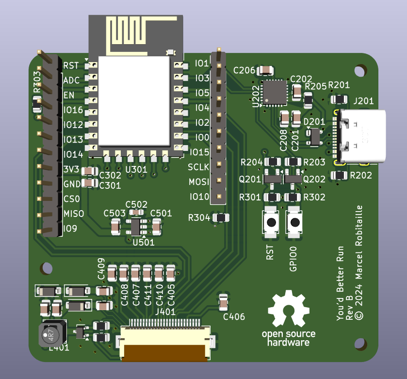

# You'd Better Run!

Lets you know if you can walk leisurely to catch the bus, or if you'd better run.

This repository holds the printed circuit board design files. A render of the PCB is below.

There are separate repositories for the firmware and 3D models.
- [Firmware](https://github.com/youdbetterrun/youdbetterrun-firmware): The code that runs on the microcontroller.
- [3D](https://github.com/youdbetterrun/youdbetterrun-3d): 3D models that need to be 3D printed and assembly instructions.
